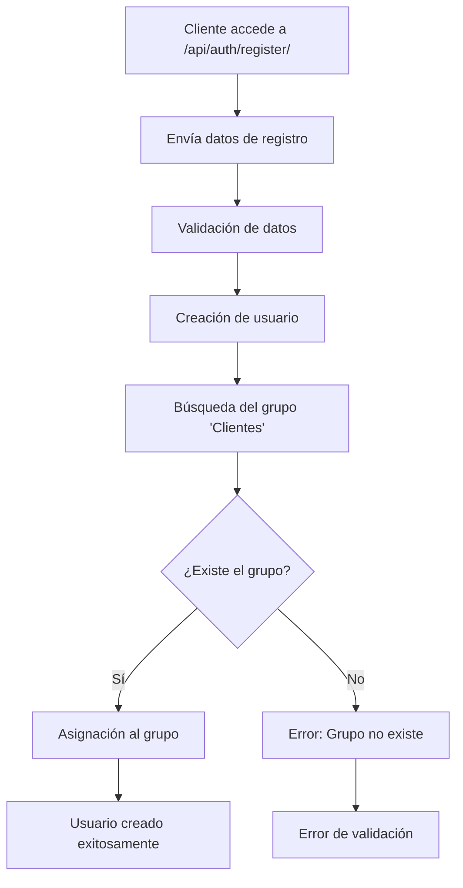

# Flujo 1: Registro Público (Auto-servicio para Clientes)

## 📋 Descripción General

El **Flujo 1** permite que los clientes se registren de forma autónoma en el sistema de joyería, asignándoles automáticamente el rol de **Cliente** con los menores privilegios posibles. El backend es responsable de la asignación de roles y la seguridad del proceso.

## 🎯 Propósito

- **Autonomía del cliente**: Los usuarios pueden registrarse sin intervención del administrador
- **Seguridad**: Asignación automática del rol con menores privilegios
- **Simplicidad**: Proceso de registro directo y sin complicaciones

## 🔧 Implementación Técnica

### Endpoint Público
```
POST /api/auth/register/
```

### Lógica en el Backend

#### Archivo: `autenticacion/serializers.py`

```python
class UserRegistrationSerializer(serializers.ModelSerializer):
    def create(self, validated_data):
        # 1. Crear usuario básico
        user = User.objects.create_user(...)
        # 2. Asignación automática al grupo 'Clientes'
        try:
            clientes_group = Group.objects.get(name='Clientes')
            user.groups.add(clientes_group)
        except Group.DoesNotExist:
            raise serializers.ValidationError(
                "El grupo 'Clientes' no existe. Contacte al administrador."
            )
        return user
```

## 🔐 Características de Seguridad

### Asignación Automática de Rol
- **Grupo**: `Clientes`
- **Privilegios**: Mínimos necesarios
- **Forzado**: Sin opción de elección por parte del usuario

### Validaciones
- ✅ Verificación de existencia del grupo 'Clientes'
- ✅ Encriptación automática de contraseñas
- ✅ Validación de campos requeridos
- ✅ Prevención de duplicados de username

## 📊 Flujo de Datos



## 🧪 Pruebas Unitarias

### Archivo: `autenticacion/tests.py`

#### Pruebas Implementadas:
1. **`test_registro_publico_asigna_grupo_clientes`**
   - Verifica asignación automática al grupo 'Clientes'
   - Confirma privilegios mínimos
2. **`test_registro_publico_grupo_no_existe`**
   - Verifica manejo de errores cuando el grupo no existe
   - Valida mensajes de error apropiados
3. **`test_endpoint_registro_publico`**
   - Prueba el endpoint completo de la API
   - Verifica respuesta HTTP correcta
4. **`test_registro_publico_permisos_minimos`**
   - Confirma que los usuarios NO son staff/superuser
   - Verifica que solo pertenecen al grupo 'Clientes'

## 🚀 Configuración Inicial

### 1. Crear Grupos de Usuarios

Ejecuta el comando de gestión para crear los grupos necesarios:
```bash
python manage.py setup_groups
```

### 2. Ejecutar Migraciones
```bash
python manage.py migrate
```

### 3. Ejecutar Pruebas
```bash
python manage.py test autenticacion.tests.Flujo1RegistroPublicoTest
```

## 📝 Ejemplo de Uso

### Request
```json
POST /api/auth/register/
Content-Type: application/json

{
    "username": "juan_perez",
    "email": "juan@example.com",
    "password": "password123",
    "first_name": "Juan",
    "last_name": "Pérez"
}
```

### Response (201 Created)
```json
{
    "id": 1,
    "username": "juan_perez",
    "email": "juan@example.com",
    "first_name": "Juan",
    "last_name": "Pérez"
}
```

## 🔍 Verificación de Implementación

### En el Admin de Django:
1. Ir a `Admin > Authentication and Authorization > Users`
2. Buscar el usuario registrado
3. Verificar que pertenece al grupo 'Clientes'

### Via API:
```bash
# Verificar grupos del usuario
GET /api/auth/profile/
Authorization: Bearer <token>
```

## ⚠️ Consideraciones Importantes

### Seguridad
- Los usuarios registrados NO tienen acceso administrativo
- Las contraseñas se encriptan automáticamente
- No se pueden asignar roles administrativos desde este flujo

### Mantenimiento
- El grupo 'Clientes' debe existir antes de usar el registro
- Usar el comando `setup_groups` para crear grupos necesarios
- Monitorear registros para detectar patrones sospechosos

### Escalabilidad
- Preparado para futuros flujos de registro (Empleados, Administradores)
- Fácil extensión para roles adicionales
- Compatible con sistemas de autenticación externos

## 🔗 Relación con Otros Flujos

- **Flujo 2**: Registro de Empleados (por administradores)
- **Flujo 3**: Registro de Administradores (solo superusuarios)
- **Flujo 4**: Gestión de Roles y Permisos

---

**Estado**: ✅ Implementado y Probado  
**Versión**: 1.0  
**Última actualización**: Julio 2025