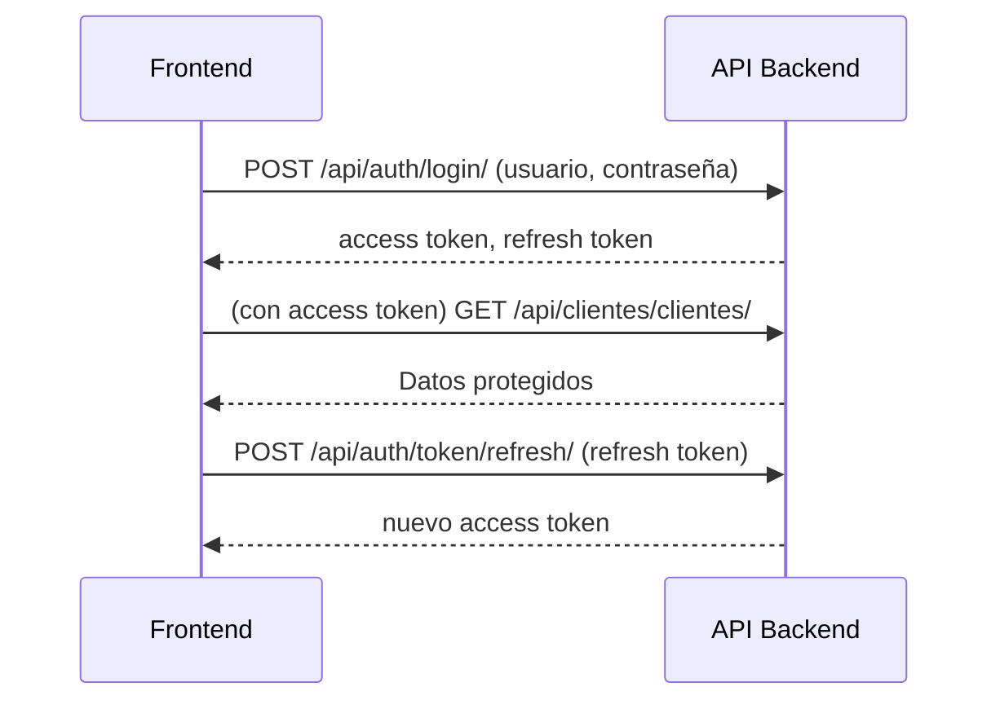

# 📚 Documentación del Flujo de Autenticación (JWT) - API Joyería

## 1. ¿Qué es JWT y por qué se usa?

**JWT (JSON Web Token)** es un estándar seguro y moderno para autenticar usuarios en APIs. Permite que el frontend (por ejemplo, React, Angular, Vue) obtenga un token tras hacer login y lo use en cada petición protegida, sin necesidad de enviar usuario/contraseña cada vez.

---

## 2. Endpoints de Autenticación Disponibles

| Endpoint                  | Método | Descripción                                      |
|---------------------------|--------|--------------------------------------------------|
| `/api/auth/login/`        | POST   | Obtener token de acceso y refresh (login)        |
| `/api/auth/token/refresh/`| POST   | Refrescar el token de acceso                     |
| `/api/auth/register/`     | POST   | Registro público de clientes                     |
| `/api/auth/profile/`      | GET    | Ver perfil del usuario autenticado               |
| `/api/auth/admin/create-user/` | POST | Crear usuario (solo admin, asigna grupo/rol)     |

---

## 3. Flujo Básico de Autenticación

### 3.1. Login (Obtener Token)

**Request:**
```http
POST /api/auth/login/
Content-Type: application/json

{
  "username": "usuario",
  "password": "contraseña"
}
```

**Response:**
```json
{
  "refresh": "<refresh_token>",
  "access": "<access_token>"
}
```
- **access**: Úsalo en el header Authorization para acceder a endpoints protegidos.
- **refresh**: Úsalo para obtener un nuevo access token cuando expire.

---

### 3.2. Usar el Token en Peticiones Protegidas

Agrega el token de acceso en el header de cada petición:
```
Authorization: Bearer <access_token>
```

**Ejemplo:**
```http
GET /api/clientes/clientes/
Authorization: Bearer <access_token>
```

---

### 3.3. Refrescar el Token

Cuando el access token expire, usa el refresh token para obtener uno nuevo:

**Request:**
```http
POST /api/auth/token/refresh/
Content-Type: application/json

{
  "refresh": "<refresh_token>"
}
```

**Response:**
```json
{
  "access": "nuevo_access_token"
}
```

---

## 4. Registro de Usuarios

### 4.1. Registro Público (Clientes)

**Request:**
```http
POST /api/auth/register/
{
  "username": "nuevo_cliente",
  "email": "cliente@correo.com",
  "password": "password123",
  "first_name": "Nombre",
  "last_name": "Apellido"
}
```
- El usuario se crea automáticamente en el grupo "Clientes".

### 4.2. Registro por Administrador (Empleados/Vendedores)

**Request (solo admin):**
```http
POST /api/auth/admin/create-user/
Authorization: Bearer <access_token_admin>
{
  "username": "nuevo_vendedor",
  "email": "vendedor@correo.com",
  "password": "password123",
  "first_name": "Nombre",
  "last_name": "Apellido",
  "group": "Vendedores"
}
```
- El usuario se crea en el grupo especificado.

---

## 5. Ver Perfil del Usuario Autenticado

**Request:**
```http
GET /api/auth/profile/
Authorization: Bearer <access_token>
```

**Response:**
```json
{
  "id": 1,
  "username": "usuario",
  "email": "usuario@correo.com",
  "first_name": "Nombre",
  "last_name": "Apellido"
}
```

---

## 6. Seguridad y Buenas Prácticas

- **Nunca compartas tu refresh token.**
- **El access token tiene corta duración** (por defecto, minutos).
- **El refresh token tiene mayor duración** (por defecto, días).
- **Cambia tu contraseña regularmente** y usa contraseñas seguras.
- **El backend valida automáticamente los permisos** según el grupo/rol del usuario.

---

## 7. Errores Comunes

- **401 Unauthorized:** Token inválido, expirado o no enviado.
- **403 Forbidden:** El usuario no tiene permisos suficientes para la acción.
- **400 Bad Request:** Datos de login o registro incorrectos.

---

## 8. Diagrama del Flujo de Autenticación



---

## 9. Referencias

- [Documentación oficial DRF JWT](https://django-rest-framework-simplejwt.readthedocs.io/en/latest/)
- [Documentación Django REST Framework](https://www.django-rest-framework.org/) 